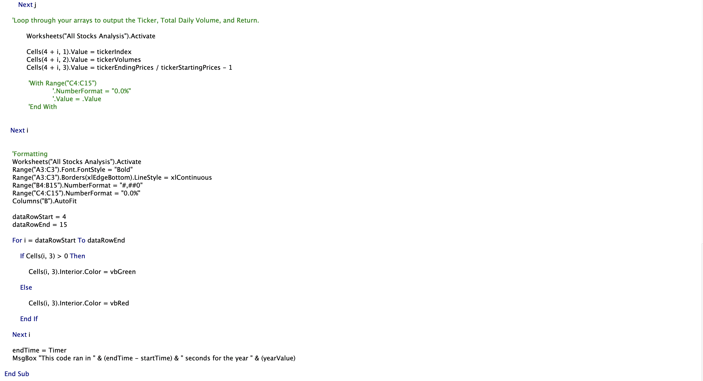
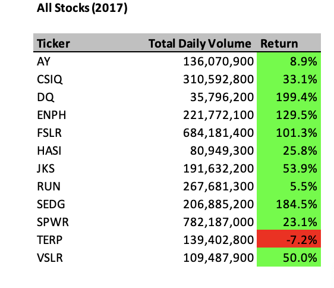
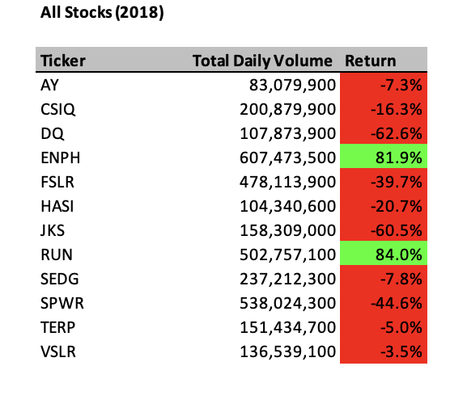
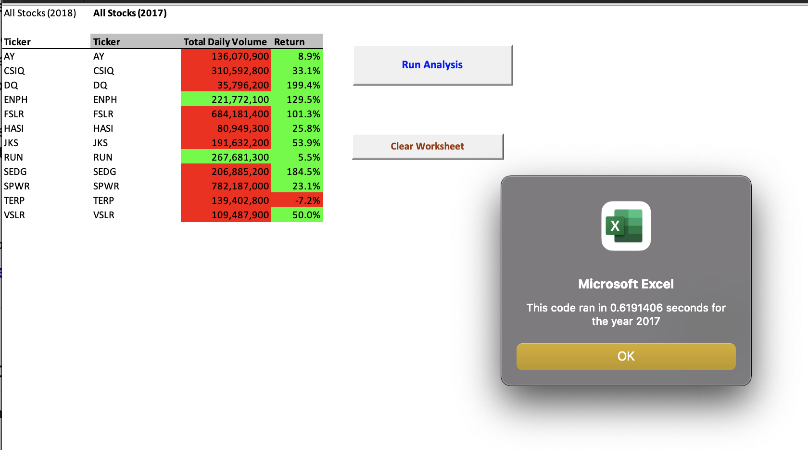
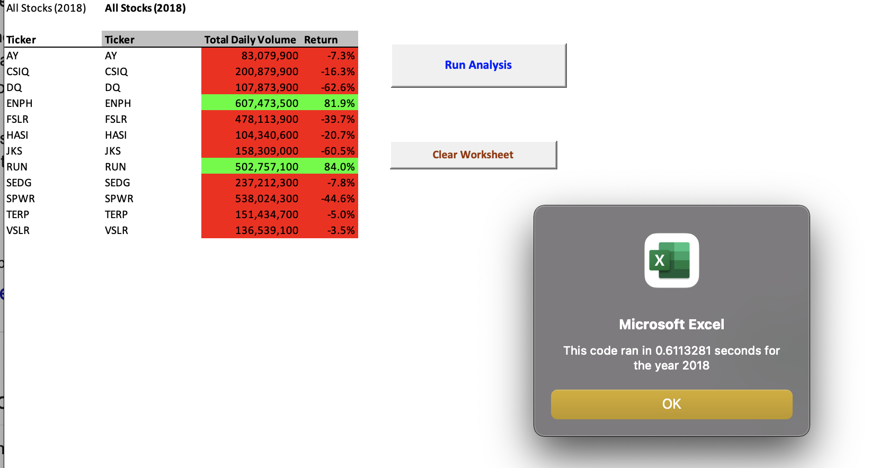

# VBA_Challenge

## OVERVIEW 
  Here we would be conduting an analysis of a selected range of stocks using ***VBA***.
  
## PURPOSE
  In this challenge, we will edit, or refactor, the Module 2 solution code to loop through all the data one time in order to collect the same information that     you did in this module. Then, we will determine whether refactoring your code successfully made the VBA script run faster. Finally, you’ll present a written     analysis   that explains your findings.

### BACKGROUND AND CHALLENGES

    Our Basic challenge was as follows :
-   Steve loves the workbook you prepared for him. At the click of a button, he can analyze an entire dataset. Now, to do a little more research for his parents,     he wants to expand the dataset to include the entire stock market over the last few years. Although your code works well for a dozen stocks, it might not         work as well for thousands of stocks. And if it does, it may take a long time to execute.

    In this challenge, you’ll edit, or refactor, the Module 2 solution code to loop through all the data one time in order to collect the same information that       you did in this module. Then, you’ll determine whether refactoring your code successfully made the VBA script run faster. Finally, you’ll present a written       analysis that explains your findings.

    Refactoring is a key part of the coding process. When refactoring code, you aren’t adding new functionality; you just want to make the code more efficient—by     taking fewer steps, using less memory, or improving the logic of the code to make it easier for future users to read. Refactoring is common on the job           because first attempts at code won’t always be the best way to accomplish a task. Sometimes, refactoring someone else’s code will be your entry point to         working with the existing code at a job.
    
-   Tasks that we performed
    - Wrote on the provided *VBS* file.
    - Creates "*.xlsm*" from a "*.vbs*" file to create dataset.
    - Opened resources folder containing VBA_Challenge.xlsm, "***VBA_Challenge_2017.PNG, VBA_Challenge_2018.PNG***" to upload on github.
    - Add the VBA_Challenge.vbs script to the Microsoft Visual Basic editor.
    - Refactor VBA code and measure performance to add code where indicated by the numbered comments in the starter code file.    

## Results
  
  In this section we will be able to observe code examples, how the stock trends are in the mentioned years and also the time stamp procedures.

- **Full Code Example provided with images showing :**.
  - How tickerIndex was set to 0.
  - How Arrays were crested for ticker, tickerVolumes, tickerStartingPrices & tickerEndingPrices.
  - The tickerIndex is used to access the stock ticker index for the tickers, tickerVolumes, tickerStartingPrices, and tickerEndingPrices arrays.
  - Created a loop that will loop over all the rows in the spreadsheet.
  - Stored values from tickerStartingPrices and tickerEndingPrices with use of If -Then statements.
  - Created Code for formatting the cells, such as green colour for positive and red for negative returns.
  - Also all code is explained through, thorough comments.
 

### Stock returns for 2017 & 2018 respectively :

- Here we will notice the changes in returns with the repective years :
#### Returns for 2017 

    
#### Returns for 2018

### The followin pictures would show the time elapsed to run the code -

#### Run time for 2017 analysis

#### Run time for 2018 analysis

# SUMARRY
## ANALYSIS AND STATMENTS :

1. ***What are the advantages and disadvantages of refactoring code in general?***
- Code refactoring must be performed in small steps and minor changes so that we can pay attention to minute details of the code.
  - Advantages :
    - VBA description of code can reveal patterns that are not easy to see in the source.
    - Using Excel flow displays program logic in a more readable manner.
    - When a well structured code is written, logical errors are very easily identified.
 
  - Disadvantages :
    - Refactoring process can affect the testing outcomes for analysis done.
    - If a complex and unstructred code is written it is best to split it into several functions.
    - A long structured code may contain the same code in multiple locations and thus we might have to change the logic to avoid duplication.

2. ***What are the advantages and disadvantages of the original and refactored VBA script?***
- When we refactor a code it is basically considereded a clean up process. Refactoring the original VBA script has its own advantages and disadvantages. Consider  if we have to refactor the code in some time after and for that refactoring the original VBA script is much easier if it a well structured code, as it much    easily read, written and definitely easy to keep a track of. If however, the code was not well structred to begin with, there is the difficulties of removinf unwanted clutter of data which can very much straining and time consuming. 

**This concludes the analysis and the derications we came up to while performing this study.**

  
       
